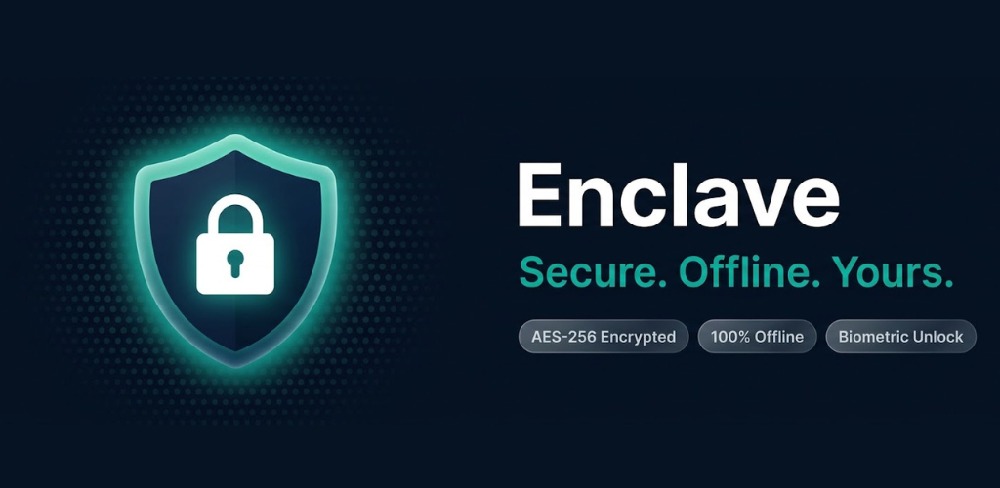

# Enclave — Offline Password Manager

<p align="center">
  
</p>

<p align="center">
  <a href="https://play.google.com/store/apps/details?id=com.paoloronco.codevault">
    
  </a>
</p>

A fully offline, secure password and secrets manager for Android. No cloud, no sync, no accounts — your data never leaves your device.

---

## Features

### Security
- **AES-256-GCM field-level encryption** — sensitive fields (password, username, notes) are encrypted at rest using a hardware-backed Android Keystore key
- **PBKDF2WithHmacSHA256** passcode hashing (65 536 iterations, 256-bit key, random salt) — the master passcode is never stored in plaintext
- **Biometric authentication** — fingerprint unlock via `BiometricPrompt` (BIOMETRIC_STRONG)
- **Auto-lock** — configurable inactivity timeout (30 s / 1 min / 2 min / 5 min / 10 min / never)
- **Lock on background** — vault locks immediately when the app is sent to background
- **Brute-force protection** — 5 wrong attempts trigger a 30-second lockout with visual countdown
- **Secure clipboard** — copied passwords are marked `IS_SENSITIVE` and auto-cleared after 30 seconds
- **Screenshot prevention** — `FLAG_SECURE` blocks screenshots and app-switcher previews (re-enable before release)

### Vault Entry Types
| Type | Fields |
|---|---|
| **Account** | Title, Username / Email, Password, Notes, Category |
| **PIN / Card** | Title, PIN (numeric, masked), Cardholder / Extra info, Notes, Category |
| **Secure Note** | Title, Note text |
| **Wi-Fi** | Title, SSID, Password, Notes, Category |

### Password Generator
Built-in generator with configurable:
- Length (8 – 32 characters)
- Uppercase letters (A–Z)
- Digits (0–9)
- Symbols (`!@#$%^&*`…)

Uses `SecureRandom` — no pseudo-random sources.

### Organisation
- **Categories**: General, Social, Banking, Email, Work, Shopping
- **Favourites** — star any entry; favourites always sort to the top
- **Search** — real-time search by title
- **Swipe to delete** with confirmation dialog

### Backup & Restore
- Export vault to an encrypted `.cvbak` file via the system file picker (SAF)
- Import from any previously exported file
- Backup file is encrypted with **AES-256-GCM + PBKDF2** derived from a user-chosen passcode — readable only with the correct passcode

### Language Support
In-app language selector (no OS restart required):
- 🇮🇹 Italian
- 🇬🇧 English
- 🇩🇪 German
- 🇪🇸 Spanish

---

## Architecture

```
app/src/main/java/com/paoloronco/codevault/
├── data/
│   ├── AccountEntity.kt       # Room entity + EntryType + Categories
│   ├── AccountDao.kt          # Room DAO (Flow queries, CRUD)
│   └── AppDatabase.kt         # Room database (v3, migrations)
├── security/
│   └── SecurityManager.kt     # Passcode hashing, field encryption, Keystore key,
│                              # biometric flags, auto-lock settings
├── backup/
│   └── BackupManager.kt       # AES-256-GCM export / import via SAF
└── ui/
    ├── MainViewModel.kt        # Single ViewModel: auth state, CRUD, clipboard, backup
    ├── Navigation.kt           # Sealed Screen routes
    └── screens/
        ├── SetupScreen.kt      # First-run passcode setup (PIN or alphanumeric)
        ├── LockScreen.kt       # PIN numpad / password unlock + biometric
        ├── PinEntry.kt         # Shared PinDots + PinNumPad composables
        ├── HomeScreen.kt       # List, search, swipe-to-delete, add-sheet
        ├── AddEditScreen.kt    # Add / edit entry (type-aware form + generator)
        ├── AccountDetailScreen.kt  # Detail view with masked fields + copy buttons
        └── SettingsScreen.kt   # Auto-lock, biometric, language, backup
```

**Stack:**
- Kotlin 2.0.21
- Jetpack Compose + Material 3
- Room 2.6.1 (plain SQLite, field-level encryption via Keystore)
- Navigation Compose 2.8.5
- AndroidX Biometric 1.1.0
- AndroidX Security Crypto 1.1.0 (EncryptedSharedPreferences)
- Android Keystore (AES-256-GCM, hardware-backed on supported devices)
- KSP 2.0.21-1.0.27

---

## Security Model

| Asset | Protection |
|---|---|
| Master passcode | PBKDF2WithHmacSHA256, 65 536 iterations, 256-bit key, 16-byte random salt |
| DB encryption key | AES-256-GCM key in Android Keystore (`codevault_field_key`), hardware-backed |
| App preferences | EncryptedSharedPreferences (AES-256-GCM / AES-256-SIV) |
| Backup file | AES-256-GCM + PBKDF2 passcode derivation, random 16-byte salt + 12-byte IV |
| Clipboard | `IS_SENSITIVE` flag + auto-clear after 30 s |
| Screen capture | `FLAG_SECURE` (enable in production) |
| Cloud backup | Disabled (`allowBackup="false"`, custom `backup_rules.xml`) |

The database file is stored at:
```
/data/data/com.paoloronco.codevault/databases/codevault_secure.db
```
This path is sandboxed by Android and inaccessible to other apps or the user without root.

---

## Requirements

| | |
|---|---|
| Min SDK | Android 9 (API 28) |
| Target SDK | Android 15 (API 35) |
| Permissions | `USE_BIOMETRIC` |

---

## Build

```bash
cd android

# Debug
./gradlew assembleDebug

# Release (requires signing config)
./gradlew assembleRelease
```

Open `android/` in Android Studio Hedgehog or newer, sync Gradle, then **Run**.

> **Before releasing:** uncomment `FLAG_SECURE` in `MainActivity.kt` to re-enable screenshot prevention.

---

## Database Migrations

| Version | Change |
|---|---|
| 1 → 2 | Added `isFavorite` column |
| 2 → 3 | Added `type` column (account / pin / note / wifi) |

---

## Privacy Policy

Enclave collects no personal data. Full policy: [sites.google.com/view/enclave-pp](https://sites.google.com/view/enclave-pp)

---

## License

Copyright (C) 2026 Paolo Ronco

This program is free software: you can redistribute it and/or modify it under the terms of the **GNU Affero General Public License** as published by the Free Software Foundation, either version 3 of the License, or (at your option) any later version.

This program is distributed in the hope that it will be useful, but WITHOUT ANY WARRANTY; without even the implied warranty of MERCHANTABILITY or FITNESS FOR A PARTICULAR PURPOSE. See the [GNU Affero General Public License](LICENSE) for more details.
